# Стилизация элементов с использованием псевдоклассов

## Цель:

Используя только CSS, оформить UI элементы исходя из их состояния

### Использованные цвета

#3498db, #2980b9, #1c5985, #ccc, #f0f0f0, #aaa

## Элементы

1. Кнопка

_В обычном состоянии_
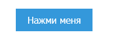

_Навели на кнопку_
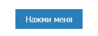

_Нажали на кнопку_
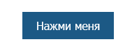

2. Поле ввода

_В обычном состоянии_
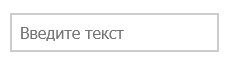

_Поле ввода активно_
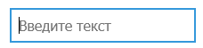

_Поле ввода отключено_
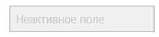

3. Список

_По ссылке не переходили_
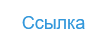

_Юзер уже переходил по ссылке_
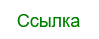

4. Лист

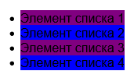

5. Чекбокс

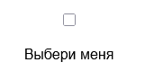
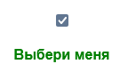

# Теория

## Синтаксис

```css
селектор:псевдокласс {
  свойство: значение;
}
```

---

## Псевдоклассы взаимодействия (User Action)

| Псевдокласс | Когда срабатывает |
|---|---|
| `:hover` | Курсор находится над элементом |
| `:active` | Элемент нажат (кнопка мыши удерживается) |
| `:focus` | Элемент получил фокус (клик или Tab) |
| `:focus-visible` | Элемент получил фокус через клавиатуру |
| `:focus-within` | Элемент или его потомок имеет фокус |

### Примеры

```css
/* Кнопка */
button { background: #3498db; }
button:hover  { background: #2980b9; }   /* навели */
button:active { background: #1c5985; }   /* нажали */

/* Поле ввода */
input { border: 1px solid #ccc; }
input:focus { border-color: #3498db; outline: none; }
```

---

## Псевдоклассы ссылок (Link States)

```css
a:link    { color: #3498db; }   /* ссылка, по которой не переходили */
a:visited { color: #aaa; }      /* ссылка, по которой уже переходили */
a:hover   { color: #2980b9; }   /* навели курсор */
a:active  { color: #1c5985; }   /* в момент клика */
```

---

## Псевдоклассы форм (Form States)

| Псевдокласс | Описание |
|---|---|
| `:disabled` | Элемент отключён (`disabled` атрибут) |
| `:enabled` | Элемент активен (по умолчанию) |
| `:checked` | Чекбокс или радио-кнопка отмечены |
| `:required` | Поле обязательно для заполнения |
| `:optional` | Поле необязательно |
| `:valid` | Значение поля прошло валидацию |
| `:invalid` | Значение поля не прошло валидацию |
| `:placeholder-shown` | В поле отображается placeholder |
| `:read-only` | Поле только для чтения |
| `:read-write` | Поле доступно для редактирования |

### Примеры

```css
/* Отключённое поле */
input:disabled {
  background: #f0f0f0;
  color: #aaa;
  cursor: not-allowed;
}

/* Чекбокс */
input[type="checkbox"] { accent-color: #3498db; }

/* Кастомный чекбокс через :checked */
input[type="checkbox"]:checked + label {
  color: #3498db;
  font-weight: bold;
}
```

---

## Структурные псевдоклассы (Structural)

| Псевдокласс | Описание |
|---|---|
| `:first-child` | Первый дочерний элемент |
| `:last-child` | Последний дочерний элемент |
| `:nth-child(n)` | n-й дочерний элемент |
| `:nth-child(odd)` | Нечётные дочерние элементы |
| `:nth-child(even)` | Чётные дочерние элементы |
| `:only-child` | Единственный дочерний элемент |
| `:first-of-type` | Первый элемент данного типа |
| `:last-of-type` | Последний элемент данного типа |
| `:nth-of-type(n)` | n-й элемент данного типа |
| `:not(селектор)` | Все элементы, кроме указанного |
| `:empty` | Элемент без дочерних узлов |

> Документация: [MDN — Pseudo-classes](https://developer.mozilla.org/ru/docs/Web/CSS/Pseudo-classes)


# Как сдавать

- Создайте форк репозитория в вашей организации с названием-этого-репозитория-вашафамилия
- Используя ветку wip сделайте задание
- Зафиксируйте изменения в вашем репозитории
- Когда документ будет готов - создайте пул реквест из ветки wip (вашей) на ветку main (тоже вашу) и укажите меня (ktkv419) как reviewer

Не мержите сами коммит, это сделаю я после проверки задания
